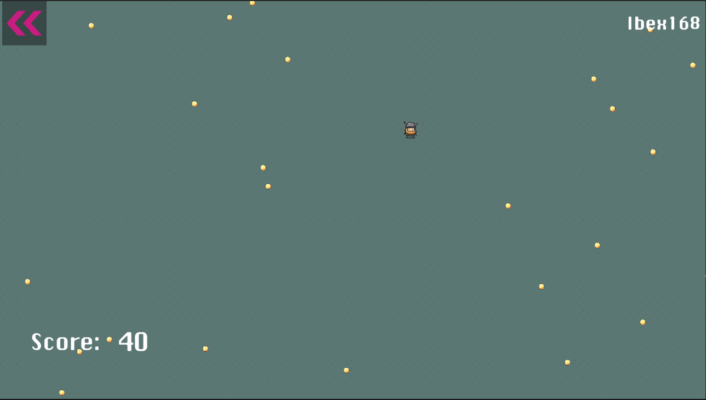

# MultiplayerMiniGame

## Descrição do Projeto

MultiplayerMiniGame é um jogo pequeno que suporta de dois a quatro usuários conectados no mapa, competindo para coletar moedas. O objetivo é obter mais moedas do que os outros jogadores.

O jogo utiliza os serviços de Lobby, Relay e Voice/Chat da Unity Game Service, aproveitando o template de gerenciamento de Lobby para facilitar o desenvolvimento. A API de lobby da Unity é altamente funcional e possui uma excelente documentação.

Para facilitar o teste do servidor/cliente, o projeto utiliza o PerreySync para duplicar o projeto. Além disso, o sistema de hot reload for Unity (link) é utilizado, permitindo a edição de scripts Unity em tempo de desenvolvimento e acelerando a interação e a velocidade de desenvolvimento.

## LeaderBoard

O jogo possui um backend simples para o leaderboard, que armazena cada partida jogada, salvando os nomes e pontuações dos usuários. Esse backend foi desenvolvido em NEST.JS

  

Ao final de cada partida, os usuários podem visualizar o leaderboard ou acessá-lo a qualquer momento no menu inicial, na opção "Leaderboard".

## Recursos Utilizados

- HotReload for Unity
- Netcode for GameObjects
- Lobby
- Relay
- Vivox
- LanguageExt.dll

## Instruções de Instalação

1. Faça o download do repositório do MultiplayerMiniGame e do repositório do backend https://github.com/Bissonho/MultiplayerMiniGameBackend
2. Abra o projeto no Unity Editor.
4. Execute o servidor backend localmente desenvolvido para permitir o funcionamento do leaderboard ( $ npm install / npm run start )
5. Compile e execute o projeto no Unity Editor ou exporte-o para a plataforma desejada.
6. Conecte dois a quatro jogadores ao jogo.
7. Competa para coletar moedas e obtenha a maior pontuação para se tornar o vencedor.

  

## Adicionado estil 2D ao Projeto
Assets utilizados: https://chr15m.itch.io/doodle-rogue-tileset

  

